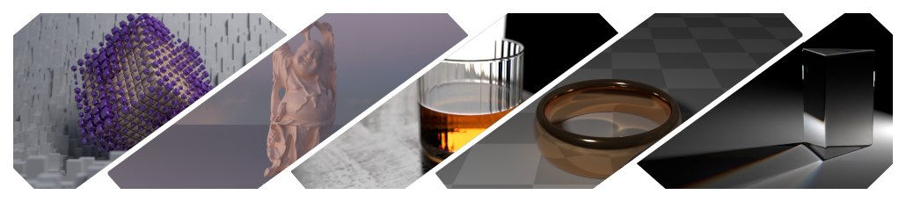
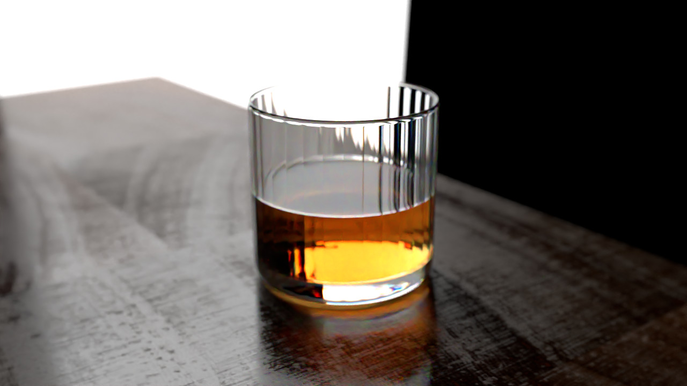
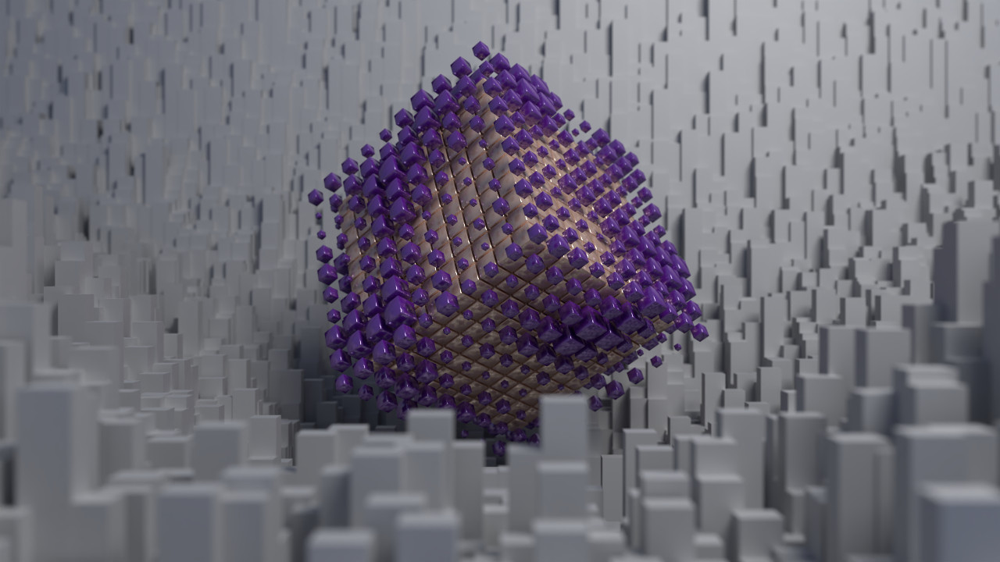
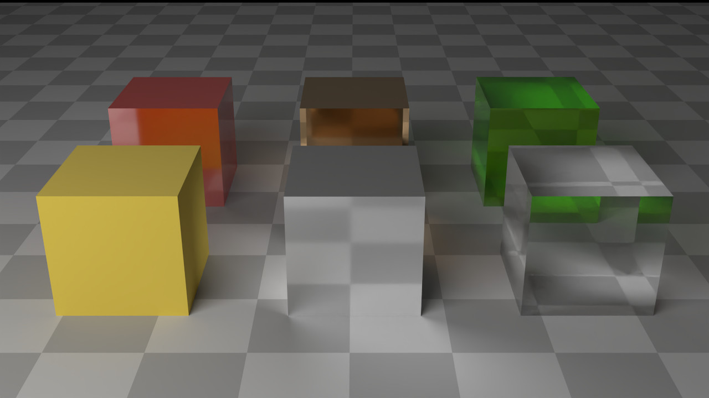
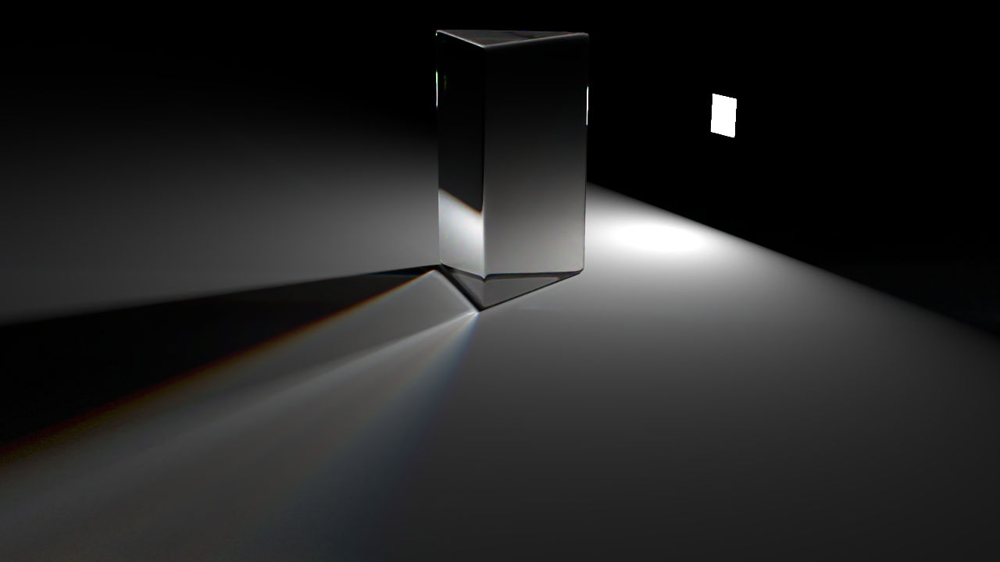
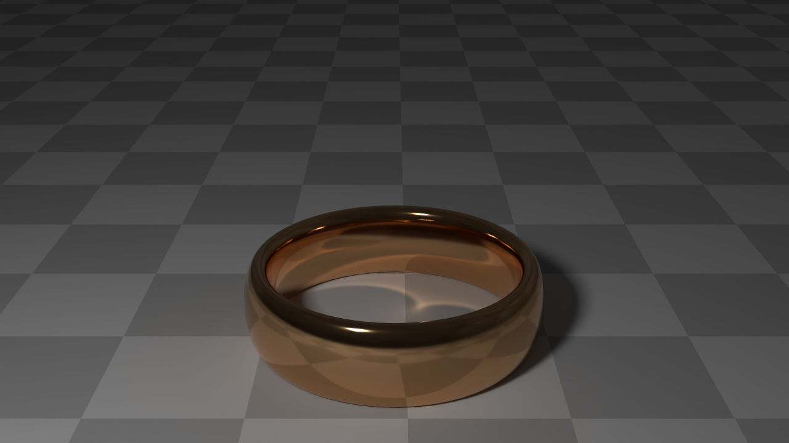
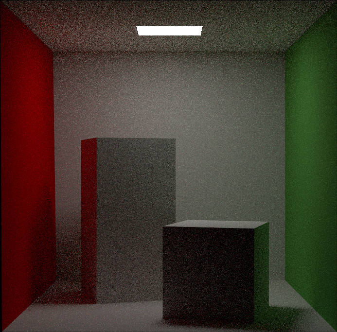
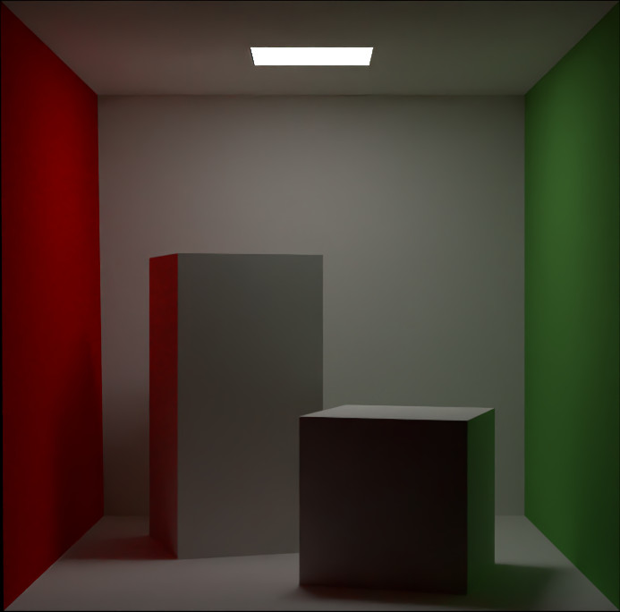

<!-- Improved compatibility of back to top link: See: https://github.com/othneildrew/Best-README-Template and https://github.com/othneildrew/Best-README-Template/pull/73 -->

# Hasty Renderer

<!-- PROJECT LOGO -->
 

  <h3 align="center">Hasty Renderer</h3>

  

    An offline path tracer hastily coded
     
     
    <a href="#gallery">View Gallery</a>
    ·
    <a href="https://github.com/JonasZehn/HastyRenderer/issues">Report Bug</a>
    ·
    <a href="https://github.com/JonasZehn/HastyRenderer/issues">Request Feature</a>
  

## About the project

I'm throwing together this pathtracer to learn more details about path tracing, the [Meson](https://mesonbuild.com/) build system, vcpkg and modern C++ features. The project fulfilled these goals, and now meson support has been discontinued due to the associated cost of upkeep.
This project currently includes a unidirectional path tracer and a stochastic progressive photon mapper, both only have CPU implementations for now.
[Intel Embree](https://www.embree.org/) is used for tracing rays and [Intel Open Image Denoise](https://www.openimagedenoise.org/) is used for denoising.

## Usage

### Requirements
* [CMake](https://cmake.org/) 3.22
* [vcpkg](https://vcpkg.io/en/getting-started.html)
* C++17 Compiler

### Build with CMake
First, edit the `cmake_vars.bat` file to setup the environment.
Install the dependencies using [vcpkg](https://vcpkg.io/) by running the `vcpkg_install_requirements_windows.bat` file.
Then run the `cmake_build.bat` file to configure and build the project.

### Input format

Currently the input format is quite simple, i.e. it the renderer takes two JSON files and an .obj file which can be e.g. exported from blender. Of course, not all features are preserved due to the choice of the file format, which I plan to change eventually.

## Roadmap

* [x] Unidirectional Path Tracer
* [x] Denoiser Integration
* [x] "Physically based" Materials
* [x] Stochastic Progressive Photon Mapper
* [x] Basic Textures
* [x] Interpolated Normals
* [x] Depth of Field
* [x] Environment Mapping
* [x] Aperture Blades
* [x] CMake Build
* [x] Linux Build
* [x] Normal Mapping
* [ ] GPU Path Tracer
	* [x] Vulkan - Initial Compute Shaders
	* [x] Vulkan - Build Acceleration Structures & Basic Ray Queries
	* [x] Create Image Comparison in Documentation
	* [ ] Refactor Path Tracer to Share Features More Easily

## References

- [An Overview of BRDF Models, 2012, R. A. Montes Soldado, C. Ureña Almagro](https://digibug.ugr.es/handle/10481/19751)
- [Hero Wavelength Spectral Sampling, 2014, A. Wilkie, S. Nawaz, M. Droske, A. Weidlich, J. Hanika](https://onlinelibrary.wiley.com/doi/abs/10.1111/cgf.12419)
- [Importance Sampling techniques for GGX with Smith Masking-Shadowing: Part 2, 2018, J. Schutte](https://schuttejoe.github.io/post/ggximportancesamplingpart2/)
- [Non-symmetric scattering in light transport algorithms, 1996, E. Veach](https://link.springer.com/chapter/10.1007/978-3-7091-7484-5_9)
- [Realistic Image Synthesis Using Photon Mapping, 2001, H. W. Jensen](https://gitea.yiem.net/QianMo/Real-Time-Rendering-4th-Bibliography-Collection/raw/branch/main/Chapter%201-24/[0822]%20[Book%202001]%20Realistic%20Image%20Synthesis%20Using%20Photon%20Mapping.pdf)
- [Robust Monte Carlo methods for light transport simulation, 1998, E. Veach](http://graphics.stanford.edu/papers/veach_thesis/thesis.pdf)
- [Stochastic Progressive Photon Mapping, 2009, T. Hachisuka, H. W. Jensen](https://dl.acm.org/doi/abs/10.1145/1661412.1618487)
- [Physically Based Shading at Disney, 2012, B. Burley](https://media.disneyanimation.com/uploads/production/publication_asset/48/asset/s2012_pbs_disney_brdf_notes_v3.pdf)

Vulkan:
- [Vulkan 1.2 Spec](https://registry.khronos.org/vulkan/specs/1.2/html/)
- [NVIDIA Vulkan Ray Tracing Tutorial](https://nvpro-samples.github.io/vk_raytracing_tutorial_KHR/)
- [Vulkan C++ examples and demos - Sascha Willems](https://github.com/SaschaWillems/Vulkan)
- [Overv / Vulkan Tutorial](https://vulkan-tutorial.com/)
- [XDC 2020 | Ray-tracing in Vulkan: A brief overview of the provisional VK_KHR_ray_tracing API](https://www.youtube.com/watch?v=-FvAJmq8NvI)

RNG:
- [Hash Functions for GPU Rendering, 2020, Mark Jarzynski, Marc Olano](https://jcgt.org/published/0009/03/02/)
- [Hash Functions for GPU Rendering, Nathan Reed](https://www.reedbeta.com/blog/hash-functions-for-gpu-rendering/)
- [PCG - A Family of Simple Fast Space-Efficient Statistically Good Algorithms for Random Number Generation, Melissa E. O’Neill](https://www.cs.hmc.edu/tr/hmc-cs-2014-0905.pdf)
- [Maximally equidistributed combined Tausworthe generators, Pierre L’Ecuyer](https://www.ams.org/journals/mcom/1996-65-213/S0025-5718-96-00696-5/)

 ## Useful Resources
- [McGuire Computer Graphics Archive - Meshes](https://casual-effects.com/data/)
- [Polyhaven](https://polyhaven.com/)
- [AmbientCG](https://ambientcg.com/)
 
 
## Gallery 

|  |  |
| ----------- | ----------- |
|  |  |

| Physically based Materials | RGB Dispersion |
| ----------- | ----------- |
|  |  | 

| Face Normals | Interpolated Normal |
| ----------- | ----------- |
|  |  | 

| No MIS | MIS |
| ----------- | ----------- |
|  |  | 

| Raw - 10 Samples per Pixel  | Denoised (Intel® Open Image Denoise)  |
| ----------- | ----------- |
|  |  | 

## CPU vs GPU - Visualizing Progress of GPU Implementation - 10 Samples
| CPU  | GPU |
| ----------- | ----------- |
|  |  |

| | |
| ----------- | ----------- |
|  |  | 
